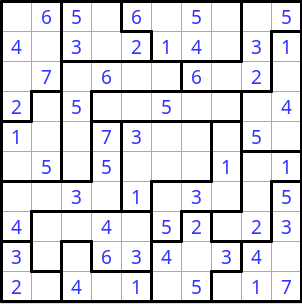
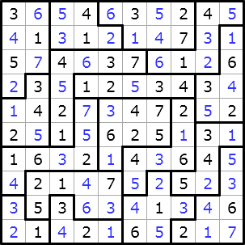

# O problema 
	Nosso trabalho consiste em desenvolver um programa em Prolog que encontre uma solução para um quebra-cabeça do tipo suguru utilizando programação de restrições. Estamos utilizando a biblioteca CLPFD como sugerido.
	Esse quebra-cabeça vem com algumas posições já escritas no tabuleiro com números. O jogo tem como base um tabuleiro n x n, dividido em tectons. Onde todas as posições livres do tectons devem ser prenchidas com cada número entre 1 e a quantidade de posições no tecton, no tentando dois números não pode ser vizinhos diagonais ou ortagonais

# Programação de Restrição
    Apesar da dificuldade de programar em um paradigma completamente novo, e utilizar um jogo diferente do que tinhamos utilizado antes, achamos que o uso do prolog foi muito vantajoso para a implementação do puzzle.
    Precisamos apenas ensinar as regras do jogo no código, e não foi necessário usar explicitamente nenhuma técnica de backtrack ou semelhantes. A solução também foi bem rápida, especialmente se compararmos com a performance do nosso resolvedor em LISP.
    Certamente o compilador adota algoritmos e heuristicas muito mais eficientes para resolver esse tipo de problema.

# Entrada de Dados
Começamos pensando como iriamos estar modelando nosso quebra-cabeça utilizandoprolog, observando as regras do Suguru, decidimos que iriamos utilizar uma matrix onde cada elemento vázio é representando por um _ que cada posição possuira dois identificadores, o primeiro sendo o tecton, e o segundo sendo o valor inteiro na determinada posição.

A entrada do jogo é escrita hardcoded dentro do código-fonte.

Em comparação a paradigmas funcionais, prolog se mostrou mais simples de se estar trabalhando, mas foi um pouco mais complicado de pegar no começo. Notamos também que a entrada de dados foi mais fácil de ser obtido comparando a outros paradigmas, onde precisamos tratar listas como matrizes e fazermos gambiarras para funcionar.

# Otimização 
    Não foram necessárias otimizações, pois como dito anteriormente, a solução já está muito rápida e o compilador/interpretador se encarregou de otimizar o código por nós.

# Divisão e dificuldades
Decidimos nesse trabalho de estar mudando o quebra-quebra que estavamos utilizando antes e vir para o Suguru. o Suguru em si não foi uma dificuldade, realizamos testes em python e não tivemos dificuldades, somente no começo da modelagem em prolog que tivemos um pouco de dificuldade pela nova linguagem.

A implementação do código foi realizada em conjunto, o começo do relátorio tinha sido começado pelo Hans, mas como avisado ao professor, o mesmo foi assaltado. Reescrevo esse relátorio de uma lanhouse. O vídeo foi gravado em conjunto e o andré editou

